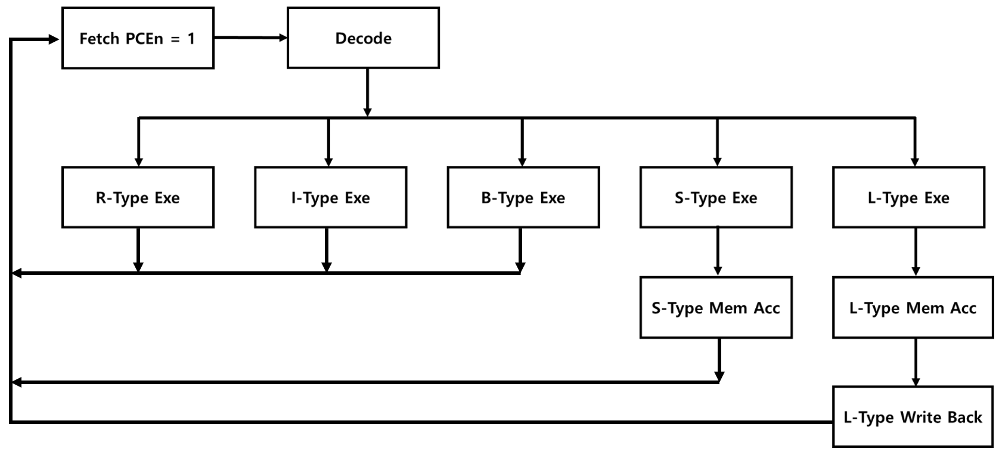
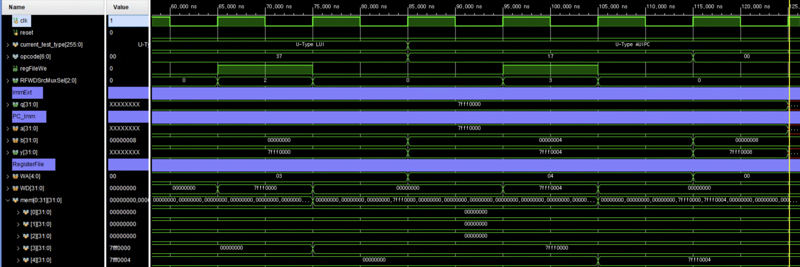

# 📌 RISC-V RV32I CPU 설계 프로젝트

### 📜 목차 (Table of Contents)

1.  [**프로젝트 개요**](#-프로젝트-개요)
2.  [**개발 환경**](#-개발-환경)
3.  [**프로젝트 구조**](#-프로젝트-구조)
4.  [**CPU 아키텍처**](#-cpu-아키텍처)
5.  [**검증 및 시뮬레이션**](#-검증-및-시뮬레이션)
6.  [**C언어 프로그램 테스트**](#-c언어-프로그램-테스트)
7.  [**문제 해결 과정**](#-문제-해결-과정)
8.  [**고찰**](#-고찰)
9.  [**향후 계획**](#-향후-계획)

---

### 🎯 프로젝트 개요

RISC-V 명령어 세트 아키텍처(ISA)를 기반으로 구현한 32비트 CPU 설계 프로젝트입니다. CPU의 핵심 구성 요소인 **데이터 경로(DataPath)**와 **제어 유닛(Control Unit)**을 System Verilog를 사용하여 설계하고 Vivado tool을 활용하여 RTL 코드를 합성하고 시뮬레이션을 통해 모든 명령어 타입의 동작을 검증하고자 했습니다. 추가적으로 C언어로 작성된 코드를 RISC-V 기계어로 변환하여 실행함으로써, 소프트웨어와 하드웨어 간의 동작방식을 이해하고, 실제 프로그램이 하드웨어에서 실행되는 전 과정을 파악하고자 했습니다.

---

### 💻 개발 환경

- **EDA**: Xilinx **Vivado HLx Editions**
- **Language**: **System Verilog**
- **IDE**: **Visual Studio Code**

---

### 📂 프로젝트 구조
```
CPU-Design/
├── docs/           # 설계 보고서, 참고 자료
├── rtl/            # SystemVerilog RTL 코드
│   ├── single/     # Single-Cycle CPU
│   ├── multi/      # Multi-Cycle CPU
│   └── dev/        # 개발 과정 기록 버전
├── testbench/      # Testbench 코드
├── sim/            # 시뮬레이션 스크립트 및 결과
└── README.md
```

---

### 🏗️ CPU 아키텍처

### ControlUnit 상태도

CPU의 모든 동작을 제어하는 Control Unit은 명령어의 종류에 따라 상태를 전환하며 데이터 경로를 제어합니다. 명령어 Fetch 및 Decode 후, 각 명령어 타입에 맞는 Execute 상태로 분기합니다.



### Block Diagram & 명령어 Type별 데이터 경로

| **DataPath** | **BType** |
| :------------------------------------------------------: | :-------------------------------------------------------: |
|  |  |
| **R-Type** | **I-Type** |
|  |  | 
| **L-Type** | **S-Type** |
|  |  |
| **J-Type(JAL)** | **JL-Type(JALR)** |
|  |  |
| **U-Type(LU)** | **U-Type(AU)** |
|  |  |

📂 [Single Cycle](./CPU/single_cycle/src)<br>
📂 [Multi Cycle](./CPU/multi_cycle/src/)

---

### 🔬 검증 및 시뮬레이션

### 테스트벤치 전략
정확한 기능 검증을 위해 체계적인 테스트벤치를 구축했습니다.
* **Task 기반 검증**: `reset_cpu`, `check_result_RF`, `check_result_DMEM` 등 반복적인 작업을 Task로 모듈화하여 테스트 효율을 높였습니다
* **매크로 경로 설정**: `define`을 사용하여 주요 모듈의 계층적 경로를 상수로 정의하여 코드의 가독성과 유지보수성을 향상시켰습니다.
* **Timeout 기능**: 지정된 시간 내에 테스트가 완료되지 않으면 시뮬레이션을 자동으로 종료시키는 로직을 추가하여 무한 루프 등의 오류를 방지했습니다.

📂 [TestBench](./CPU/multi_cycle/testbench)

---

### 시뮬레이션 결과

| 명령어 타입 | 시뮬레이션 파형 |
| :-------: | :---------: |
| **R-Type** |  |
| **I-Type** |  |
| **L-Type** |  |
| **S-Type** |  |
| **B-Type** |  |
| **U-Type (LUI&AUIPC)**|  |
| **J-Type (JAL)** |  |
| **J-Type (JALR)** |  |

---

### 🔄 C언어 프로그램 테스트

설계된 RV32I의 실제 동작을 검증하기 위해 간단한 C언어 프로그램을 어셈블리어로 변환 후 이를 머신코드로 변환하여 테스트를 진행했습니다. `main` 함수에서 `add` 함수를 호출하여 `3 + 5` 연산을 수행하는 코드를 사용했으며, 시뮬레이션을 통해 최종 결과값 `8`이 레지스터에 저장되는 것을 확인했습니다.

```c
int add(int a, int b);

int main()
{
    int sum;
    sum = add (3,5);
}

int add(int a, int b)
{
    return a + b;
}
```

```bash
main:
        addi    sp,sp,-32
        sw      ra,28(sp)
        sw      s0,24(sp)
        addi    s0,sp,32
        li      a1,5
        li      a0,3
        call    add
        sw      a0,-20(s0)
        li      a5,0
        mv      a0,a5
        lw      ra,28(sp)
        lw      s0,24(sp)
        addi    sp,sp,32
        jr      ra
add:
        addi    sp,sp,-32
        sw      ra,28(sp)
        sw      s0,24(sp)
        addi    s0,sp,32
        sw      a0,-20(s0)
        sw      a1,-24(s0)
        lw      a4,-20(s0)
        lw      a5,-24(s0)
        add     a5,a4,a5
        mv      a0,a5
        lw      ra,28(sp)
        lw      s0,24(sp)
        addi    sp,sp,32
        jr      ra
```

```
10001137
fe010113
00112e23
00812c23
02010413
00500593
00300513
020000ef
fea42623
00000793
00078513
01c12083
01812403
02010113
00008067
fe010113
00112e23
00812c23
02010413
fea42623
feb42423
fec42703
fe842783
00f707b3
00078513
01c12083
01812403
02010113
00008067
```

### 시뮬레이션 결과


---

### 🛠️ 문제 해결 과정

**S-Type 명령어 처리 로직 개선**

- **문제점**: S-Type 명령어(`sh`, `sb`) 처리 시, 데이터 경로에서는 이미 `Byte_Enable`을 고려하여 32비트로 정렬된 쓰기 데이터(`BE_WData`)를 생성하고 있었습니다. 하지만 RAM 모듈에서 `Byte_Enable` 신호를 받아 부분 쓰기(partial write)를 수행하는 중복 로직이 존재했습니다.
- **해결책**: 데이터 경로에서 이미 정렬된 데이터를 보내주므로, RAM에서는 `Byte_Enable` 없이 32비트 `wData`를 그대로 쓰는 방식으로 단순화했습니다.
- **개선 효과**: 불필요한 제어 신호를 제거하여 데이터 경로를 단순화하고 설계 효율성을 향상시켰습니다.

---

### 🧠 고찰

- **소프트웨어와 하드웨어의 연결고리 이해**: C언어 코드가 어셈블리어와 기계어로 변환되는 과정을 직접 수행하며, 추상적인 고급 언어의 연산이 하드웨어에서 어떻게 구체적인 명령어로 실행되는지 명확히 파악할 수 있었습니다.
- **CPU 아키텍처 설계 방식에 대한 고찰**: Multi-Cycle 방식은 제어가 복잡하지만 하드웨어 자원을 효율적으로 사용하여 성능을 높일 수 있다는 점을 확인했습니다. 학습 목적과 실제 구현 효율을 고려한 아키텍처 선택의 중요성을 배울 수 있었습니다.

---

### 📚 향후 계획

```
Pipeline CPU 설계
Hazard 제어 (Forwarding, Stall, Branch Prediction)

```
